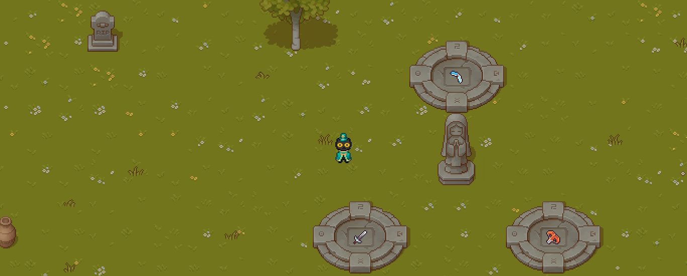
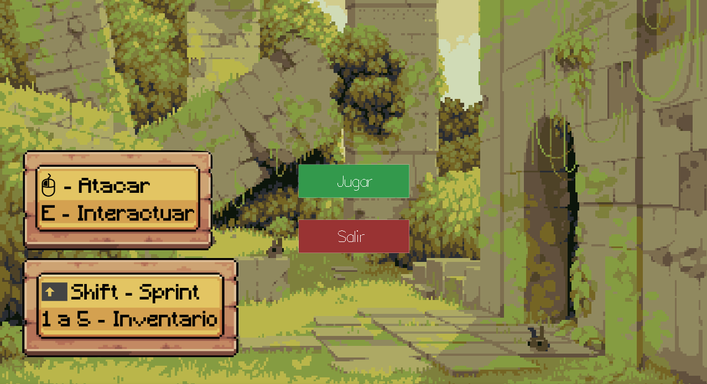

# info188-haski: Haski, Aventura Top-Down en Haskell

**Haski** es un videojuego de acción y aventura con perspectiva *top-down* (desde arriba), desarrollado en **Haskell**. Este proyecto demuestra la aplicación de la programación funcional pura en el desarrollo de videojuegos en dos dimensiones, utilizando la librería gráfica `Gloss` y gestionando la complejidad del estado del juego mediante la mónada `State`.

### Integrantes del equipo:
* Eduardo Montecinos.
* Cristóbal Silva.
* Diego Soto.
* Matías Soto.
* Matías Toledo.



## Descripción del proyecto

El objetivo de **Haski** es combatir (o sobrevivir) las olas de enemigos que emergen y persiguen al jugador dentro de un mapa con elementos interactivos (cajas y vasijas que se rompen, armas recogibles para defenderse e ítems que le traen beneficios al protagonista). El motor del juego implementa físicas básicas, detección de colisiones precisa con el entorno y un sistema de renderizado por capas.

El núcleo del juego se basa en la manipulación inmutable del estado (`GameState`), donde cada *frame* o evento de entrada genera un nuevo estado del mundo sin efectos secundarios, siguiendo los principios de Haskell.

## Características principales

  * **Motor Gráfico con Gloss:** Renderizado eficiente de *sprites*, animaciones y texto.
  * **Mapa Dinámico (JSON):** Carga de mapas diseñados en *Tiled* exportados a JSON, soportando múltiples capas (suelo, estructuras, decoración) y metadatos de colisión.
  * **Sistema de Inventario:** Gestión de 5 *slots* con capacidad de recoger (`Pickup`), equipar y soltar (`Drop`) objetos.
  * **Armas y Combate:**
      * **Ballesta:** Dispara proyectiles con físicas lineales y *cooldown*.
      * **Boomerang:** Implementa una lógica de estado compleja (`Flying` -> `Returning`) con aceleración y retorno dinámico al jugador.
      * **Espada:** (Implementación visual y lógica de daño a corta distancia).
  * **Entorno Destructible:** Objetos como barriles y cajas tienen vida, pueden ser destruidos y sueltan *loot* (pociones).
  * **HUD Interactivo:** Barra de vida, visualización de inventario, *cooldowns* y notificaciones flotantes de objetos.

## Instalación y ejecución

El proyecto utiliza un `Makefile` para facilitar la gestión de dependencias y compilación.

### Requisitos previos

  * GHC (Glasgow Haskell Compiler)
  * Cabal

### Pasos

1.  **Instalar dependencias:**

    ```bash
    make install-deps
    ```

    Esto instalará librerías clave como `gloss`, `gloss-juicy` (imágenes), `aeson` (JSON), `linear`, `mtl`, etc.

2.  **Compilar el juego:**

    ```bash
    make
    ```

    Esto generará el ejecutable en la carpeta `bin/`.

3.  **Ejecutar:**

    ```bash
    make run
    ```

4.  **Limpiar archivos temporales:**

    ```bash
    make clean
    ```

-----

## Controles

| Tecla | Acción |
| :--- | :--- |
| **W, A, S, D** | Movimiento del personaje |
| **Shift (Izq)** | Correr (*Sprint*) |
| **Clic Izquierdo** | Usar objeto equipado (Atacar/Disparar) |
| **E** | Recoger objeto cercano |
| **Q** | Soltar objeto equipado |
| **1 - 5** | Seleccionar *slot* del inventario |
| **ESC** | Pausa / Volver al Menú |

-----

## Arquitectura técnica

El proyecto se divide en módulos funcionales para separar la lógica, el renderizado y los datos.

### Gestión de estado (State Monad)

En lugar de pasar manualmente el estado del juego (`GameState`) a través de docenas de funciones, se utiliza la mónada `State`. Esto permite escribir código imperativo-like dentro de un contexto funcional puro.

  * **Logic.hs:** Contiene la lógica de actualización. Funciones como `updateGame`, `handleInputEvent` o `updatePlayerMovement` operan dentro del contexto `State GameState ()`.
  * **Ventaja:** Facilita la modificación profunda de estructuras anidadas (como actualizar la vida de un objeto destructible específico dentro de una lista en el estado global).

### Carga de mapas (MapLoader)

El módulo `MapLoader.hs` utiliza `Aeson` para parsear archivos `.JSON` generados por el editor de mapas **Tiled**.

  * **Tilesets:** Se cargan dinámicamente las rutas de las imágenes y los GIDs (Global ID) de cada tile.
  * **Capas:** El juego renderiza el mapa separando capas "bajo el jugador" (suelo) y "sobre el jugador" (copas de árboles), permitiendo profundidad visual.

### Sistema de colisiones

Se implementa un sistema de colisiones robusto en `Logic.hs` que soporta:

1.  **Colisión Mapa-Jugador:** Verifica si la posición futura del jugador intersecta con algún *tile* sólido o *shape* de colisión definida en el mapa.
2.  **Colisión Proyectil-Objeto:** Utiliza geometría básica (distancia euclidiana y AABB) para detectar impactos.
3.  **Objetos Destructibles:** Los objetos tienen *hitboxes* y puntos de vida (`destHealth`). Al llegar a 0, se elimina el tile visual del mapa y se genera una entidad de *loot*.

-----

## Estructura del código

  * **`Main.hs`**: Punto de entrada. Inicializa la ventana de Gloss, carga los assets/mapas y ejecuta el bucle principal (`play`).
  * **`Types.hs`**: Define todas las estructuras de datos (`Player`, `GameState`, `WorldItem`, `DestructibleObject`). Es la "verdad" del sistema.
  * **`Logic.hs`**: El cerebro del juego. Contiene toda la lógica de actualización, física, input y reglas de juego.
  * **`Render.hs`**: Se encarga de traducir el `GameState` a una imagen (`Picture`) de Gloss. Maneja la cámara y el dibujado de *sprites*.
  * **`Assets.hs`**: Utiliza `JuicyPixels` para cargar imágenes PNG y convertirlas en texturas utilizables por Gloss.
  * **`MapLoader.hs`**: Lógica de parseo de JSON y extracción de datos de Tiled.
  * **`HUD/`**:
      * `HealthBar.hs`: Dibuja la vida del jugador.
      * `Inventory.hs`: Renderiza la barra de slots e items.
      * `Rendering.hs`: Compone la interfaz de usuario completa.

-----

## Cierre

Este juego ha sido desarrollado como proyecto para la asignatura de **INFO188 Paradigmas de Programación Funcional y Paralelo**.

  * **Sprites y Tilesets:** Pixel Art Top Down - Basic v1.1.2 (y variaciones).
  * **Librerías Haskell:** Gloss, Aeson, JuicyPixels, Mtl.
  * **Herramientas:** Tiled (Diseño de niveles), Aseprite (Edición de sprites).

-----
